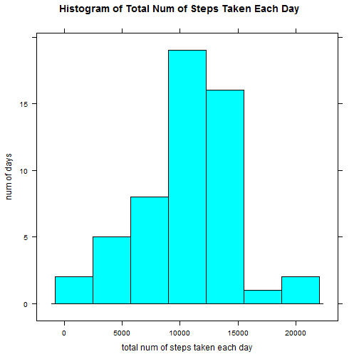
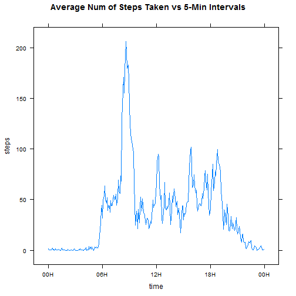

Data Analysis - Personal Activity Monitoring Devices
========================================================

## Introduction

It is now possible to collect a large amount of data about personal movement using activity monitoring devices such as a Fitbit, Nike Fuelband, or Jawbone Up. These type of devices are part of the "quantified self" movement - a group of enthusiasts who take measurements about themselves regularly to improve their health, to find patterns in their behavior, or because they are tech geeks. But these data remain under-utilized both because the raw data are hard to obtain and there is a lack of statistical methods and software for processing and interpreting the data.

This analysis makes use of data from a personal activity monitoring device. This device collects data at 5 minute intervals through out the day. The data consists of two months of data from an anonymous individual collected during the months of October and November, 2012 and include the number of steps taken in 5 minute intervals each day.

## Data

The data for this analysis can be downloaded from the course web site:

* Dataset: [Activity monitoring data](https://d396qusza40orc.cloudfront.net/repdata%2Fdata%2Factivity.zip) [52K]

The variables included in this dataset are:

* steps: Number of steps taking in a 5-minute interval (missing values are coded as *NA*)

* date: The date on which the measurement was taken in YYYY-MM-DD format

* interval: Identifier for the 5-minute interval in which measurement was taken

The dataset is stored in a comma-separated-value (CSV) file and there are a total of 17,568 observations in this dataset.

## Loading and preprocessing the data

The data is first loaded and preprocessed using the following R code:

```r
activity <- read.table(file="activity.csv", sep=",", header=T, na.strings="NA", 
                       colClasses=c("numeric", "character", "numeric"))
activity$date <- strptime(activity$date, format="%Y-%m-%d")
```

## Mean Total Number of Steps Taken per Day

Let us first ignore the missing data and look at the frequencies of mean total steps taken per day:

```r
activityWoNa <- activity[!is.na(activity$steps),]
activityTotalSteps <- aggregate(x=activityWoNa$steps, 
                                by=list(cut(activityWoNa$date, breaks="day")), 
                                FUN=sum)
colnames(activityTotalSteps) <- c("date", "steps")
library(lattice)
histogram(activityTotalSteps$steps, type=c("count"),
          main="Histogram of Total Num of Steps Taken Each Day", 
          xlab="total num of steps taken each day",
          ylab="num of days")
```

 

The **mean** and **median** are calculated as follow:

```r
mean(activityTotalSteps$steps)
```

```
## [1] 10766
```

```r
median(activityTotalSteps$steps)
```

```
## [1] 10765
```

## Average Daily Activity Pattern
A time series plot of the 5-minute interval against the average number of steps taken, averaged across all days is as such:

```r
activityFiveMinMean <- aggregate(x=activity$steps, 
                                 by=list(factor(activity$interval)), 
                                 FUN=mean, na.rm=TRUE)
colnames(activityFiveMinMean) <- c("interval", "steps")
activityFiveMinMean$interval <- as.numeric(
  levels(activityFiveMinMean$interval))[activityFiveMinMean$interval]
activityFiveMinMean$time <- strptime(paste(activityFiveMinMean$interval%/%100, 
                                           activityFiveMinMean$interval%%100), 
                                     format="%H %M")
with(activityFiveMinMean,
     xyplot(steps ~ as.POSIXct(time), type="l", xlab="time",
            scales=list(x=list(at= seq(time[1], by="6 hour", length=5), 
                               labels=format(seq(time[1], by="6 hour", length=5), "%HH"))),
            main="Average Num of Steps Taken vs 5-Min Intervals")
)
```

 

To find out the 5 min interval that contains the **maximum number of steps**:

```r
maxStep <- max(activityFiveMinMean$steps)
for(i in 1:nrow(activityFiveMinMean)) {
    if(activityFiveMinMean[i, "steps"] == maxStep) {
        print(activityFiveMinMean[i, "interval"])
    }
}
```

```
## [1] 835
```

## Inputing Missing Values
So far, we have been ignoring the missings value from the dataset. The total number of missing values is:

```r
sum(is.na(activity$steps)==TRUE)
```

```
## [1] 2304
```

And now, we are going to fill them in. **The strategy is to substitute them with their respective 5-minute interval across all days.** The code to do this is as follow:

```r
# creating a named vector; this essentially works as a hashmap
activityFiveMinMeanV <- activityFiveMinMean$steps
names(activityFiveMinMeanV) <- activityFiveMinMean$interval

activityFilled <- activity
for(i in 1:nrow(activityFilled)) {
    if(is.na(activityFilled[i, "steps"])) {
        activityFilled[i, "steps"] <- activityFiveMinMeanV[as.character(
          activityFilled[i, "interval"])]
    }
}
```

Analysing on the resulting histogram:


```r
activityTotalSteps2 <- aggregate(x=activityFilled$steps, by=list(cut(activityFilled$date, 
                                                                     breaks="day")), FUN=sum)
colnames(activityTotalSteps2) <- c("date", "steps")
histogram(activityTotalSteps2$steps, type=c("count"),
          main=paste("Histogram of Total Num of Steps Taken Each Day\n",
                     "(After Inputing Missing Values)"), 
          xlab="total num of steps taken each day",
          ylab="num of days")
```

 

And the **mean** and **median**:

```r
mean(activityTotalSteps2$steps)
```

```
## [1] 10766
```

```r
median(activityTotalSteps2$steps)
```

```
## [1] 10766
```

We find that the frequencies around the mean increases, and that the mean and median are very close to their previous values.  These are expected because we are after all inputing the mean value of 5-minutes interval across all day, which in effect contributes to the daily mean in a more or less neutral manner.  And since now that the *NA* values are being substituted with neutral values, its occurances increases, making the mean containing bar even taller in its histogram.  This also, in effect, increases the chances of making the median the same as the mean.

## Differences in Activity Patterns between Weekdays and Weekends

Comparing weekdays and weekends activities, we have the following plot:

```r
activityFilled$date <- strptime(activity$date, format="%Y-%m-%d")
activityFilled$day <- weekdays(activity$date, TRUE)
activityFilled$dayType <- ifelse(activityFilled$day %in% c("Sat", "Sun"), 1, 0)
activityFilled$dayType <- factor(activityFilled$dayType, labels=c("Weekday", "Weekend"))
activityDayType <- aggregate(activityFilled$steps, by=list(factor(activityFilled$interval),
                                                           activityFilled$dayType), FUN=mean)
colnames(activityDayType) <- c("interval", "day", "steps")
activityDayType$interval <- as.numeric(levels(activityDayType$interval))[activityDayType$interval]
activityDayType$time <- strptime(paste(activityDayType$interval%/%100, 
                                       activityDayType$interval%%100), format="%H %M")
activityDayType$time <- as.POSIXct(activityDayType$time)

with(activityDayType, 
  xyplot(steps ~ time | day, type="l", layout=c(1,2),
         scales=list(x=list(at= seq(time[1], by="6 hour", length=5), 
                            labels=format(seq(time[1], by="6 hour", length=5), "%HH"))),
         main=paste("Comparison Between the Num of Steps Taken\n",
                    "Per 5-Min Interval Across Wkdays and Wkends"))
)
```

 

It is interesting to note the following points:
* the number of steps reaches the maximum at around the same time for both weekday and weekend
* the tallest peak on weekday is higher than that on weekend (indicates higher walking speed)
* activity starts earlier on weekday than on weekend
